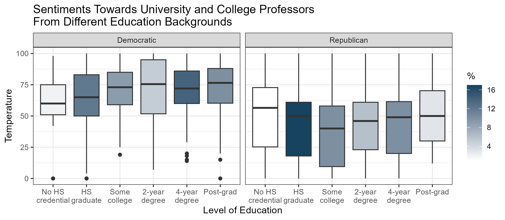

# Degrees of Division: How Democrats and Republicans View Higher Education

This project explores how political affiliation influences attitudes toward higher education in the United States. Using data from the [American National Election Studies (ANES)](https://electionstudies.org), we visualize partisan differences in:

- Educational attainment  
- Approval of college and university governance  
- Sentiment toward university professors (measured using a 0–100 feelings thermometer)

The dataset was filtered to include only respondents who identified as either Democratic or Republican, reducing the total from 1,910 to 1,460 cases.

---

## Education Level by Political Party

Democrats generally have higher levels of education, with more individuals completing four-year and postgraduate degrees. Republicans are more concentrated in the high school graduate category, highlighting a noticeable divide in educational attainment between the two parties.

---

## Approval of How Colleges and Universities Are Run

Republicans tend to express strong disapproval and skepticism toward college and university governance. In contrast, Democrats are more neutral to favorable, as indicated by the relatively balanced distribution of approval levels.

---

## 🌡️ Feelings Thermometer Toward University and College Professors

A feelings thermometer is a scale from 0 to 100 that measures how warmly or coldly a respondent feels toward a person or group. Democrats express overwhelmingly positive feelings toward college professors, while Republicans show a broader range of responses, often leaning toward more negative sentiments.

---

## Sentiments Toward Professors Based on Approval of Higher Education

Boxplots compare how Democratic and Republican voters feel about professors based on their approval of how universities are run. Republican views are tightly linked to institutional approval, with colder sentiments concentrated in the "Disapprove strongly" group. Democrats show consistently warm feelings across all approval levels.

---

## Sentiments Toward Professors by Education Backgrounds

This boxplot compares thermometer scores across education levels. Democrats display relatively uniform and warm attitudes regardless of their education background, especially among college graduates. Republicans remain cooler across all levels, with the HS graduate group being the largest and coldest.

---

## Files

- `anes_pilot_2024_20240319.csv`: Raw ANES survey data used for analysis  
- `degrees-of-division.Rmd`: R Markdown file for data wrangling, modeling, and visualization  
- `degrees-of-division.pdf`: Rendered PDF version of the report  
- `degree-of-division-full-report.pdf`: PDF version of the full report with additional co-writer analysis
- `figures/`: Folder containing all exported plots in `.png` format

---

## Tools

- R, RStudio  
- Packages: `ggplot2`, `dplyr`, `tidyverse`, `stargazer`, `sandwich`, `lmtest`, `scales`, `rmarkdown`

---

## Citation

American National Election Studies. 2024. ANES 2024 Pilot Study. March 19, 2024 version.  
<https://electionstudies.org/data-center/2024-pilot-study/>